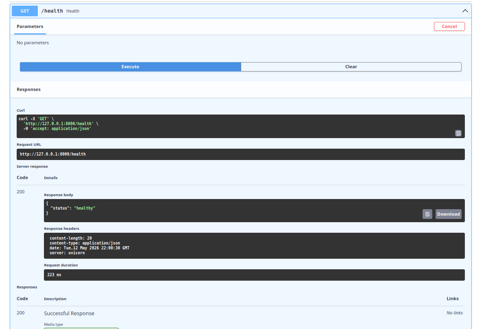
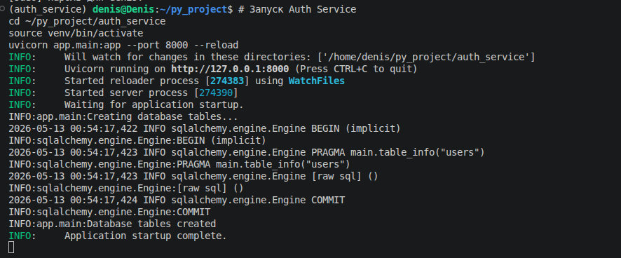
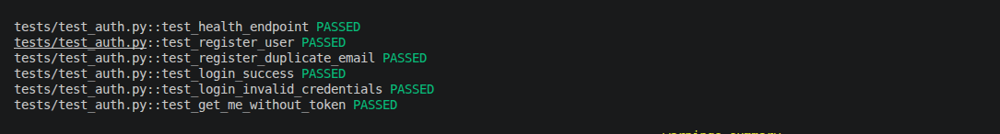
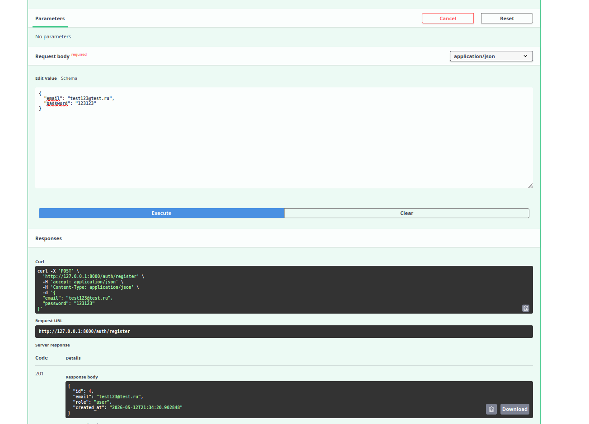
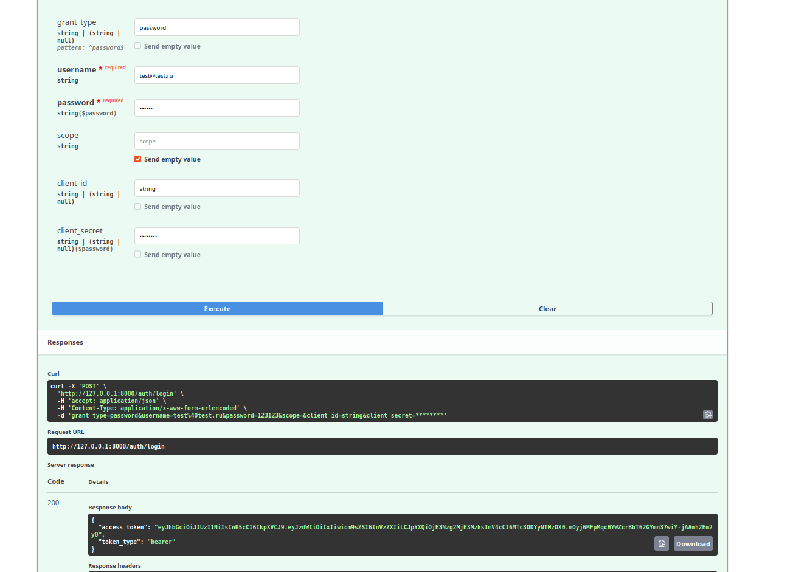
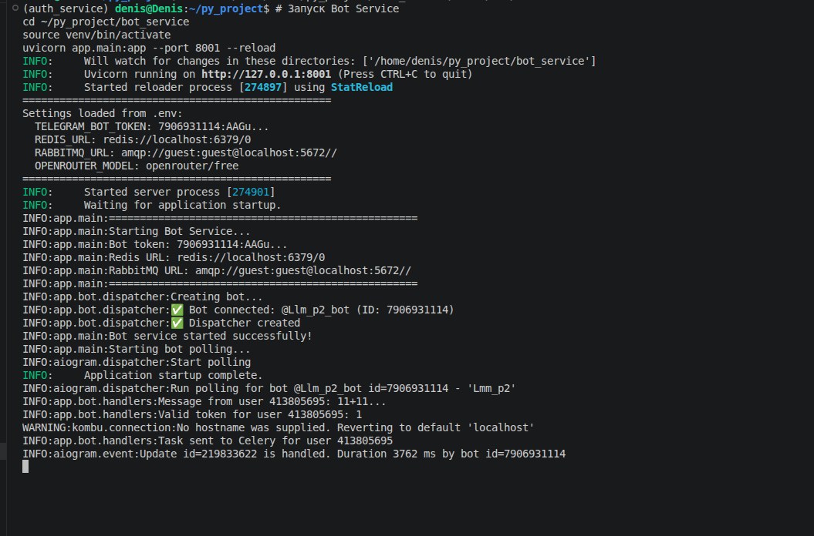
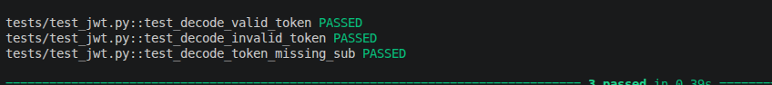
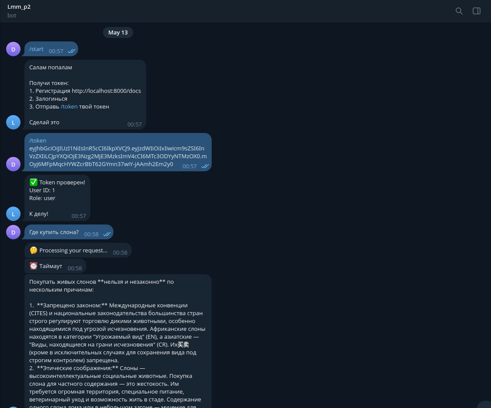
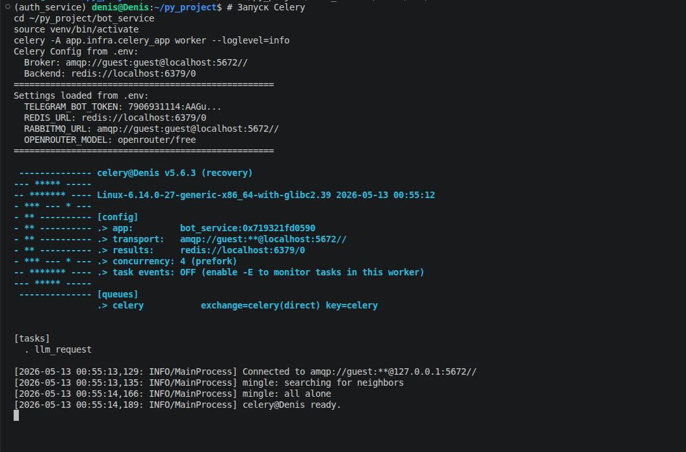

**Микросервисная система для LLM-консультаций через Telegram-бота с JWT-аутентификацией**

---

## 📋 О проекте

Проект представляет собой двухсервисную архитектуру для предоставления LLM-консультаций через Telegram-бота.

### 🎯 Ключевые особенности

- **Auth Service** - отвечает за аутентификацию и выдачу JWT-токенов
- **Bot Service** - предоставляет LLM-консультации через Telegram
- Сервисы независимы и общаются через JWT
- Асинхронная обработка запросов через Celery + RabbitMQ

---

## 🏗️ Архитектура

┌─────────────────┐ ┌─────────────────┐ ┌─────────────────┐
│ Auth Service │────▶│ JWT Token │────▶│ Bot Service │
│ (FastAPI) │ │ │ │ (aiogram) │
└────────┬────────┘ └─────────────────┘ └────────┬────────┘
│ │
▼ ▼
┌───────────┐ ┌───────────────┐
│ SQLite │ │ Celery + │
│ │ │ RabbitMQ │
└───────────┘ └───────┬───────┘
│
▼
┌───────────┐
│ Redis │
│ + LLM │
└───────────┘
text

---

## 🚀 Возможности

- ✅ Регистрация и аутентификация пользователей с JWT
- ✅ Telegram-бот с верификацией JWT
- ✅ Асинхронная обработка запросов через Celery + RabbitMQ
- ✅ Кэширование через Redis
- ✅ Интеграция с LLM через OpenRouter API
- ✅ Swagger документация для Auth Service
- ✅ Полное тестирование

---

## 📸 Скриншоты

### Auth Service - Swagger документация

| Эндпоинт | Скриншот |
|----------|----------|
| Health Check |  |
| Start Page |  |
| Tests |  |
| Auth Bot |  |

### Регистрация и авторизация

| Функция | Скриншот |
|---------|----------|
| Регистрация пользователя |  |
| Авторизация (Login) |  |

### Telegram Bot

| Команда | Скриншот |
|---------|----------|
| Start Bot |  |
| Bot Testing |  |
| Bot Response |  |

### Celery + RabbitMQ

| Компонент | Скриншот |
|-----------|----------|
| Celery Worker |  |

---

## 🛠️ Технологический стек

| Компонент | Технология |
|-----------|------------|
| Web Framework | FastAPI |
| Telegram Bot | aiogram 3.x |
| Task Queue | Celery |
| Message Broker | RabbitMQ |
| Cache | Redis |
| Database | SQLite + SQLAlchemy |
| Auth | JWT + bcrypt |
| LLM API | OpenRouter |
| Testing | pytest + pytest-asyncio |

---

## 📦 Установка и запуск

### Требования

- Python 3.11+
- RabbitMQ
- Redis
- Telegram Bot Token (от @BotFather)
- OpenRouter API Key (опционально)

### 1. Клонирование репозитория

git clone https://github.com/Des1071/dz2.git
cd dz2

2. Настройка виртуального окружения

# Auth Service
cd auth_service
python -m venv venv
source venv/bin/activate  # Windows: venv\Scripts\activate
pip install -r requirements.txt

# Bot Service
cd ../bot_service
python -m venv venv
source venv/bin/activate
pip install -r requirements.txt

3. Настройка переменных окружения

Скопируйте примеры и заполните:

cp auth_service/.env.example auth_service/.env
cp bot_service/.env.example bot_service/.env

Важно: JWT_SECRET должен быть одинаковым в обоих сервисах!
4. Запуск сервисов

# Запуск RabbitMQ и Redis
sudo systemctl start rabbitmq-server redis-server

# Терминал 1 - Auth Service
cd auth_service
source venv/bin/activate
uvicorn app.main:app --port 8000 --reload

# Терминал 2 - Celery Worker
cd bot_service
source venv/bin/activate
celery -A app.infra.celery_app worker --loglevel=info

# Терминал 3 - Bot Service
cd bot_service
source venv/bin/activate
uvicorn app.main:app --port 8001 --reload

5. Использование

    Регистрация пользователя: POST http://localhost:8000/auth/register

    Получение JWT: POST http://localhost:8000/auth/login

    Запуск бота: Напишите /start боту в Telegram

    Авторизация: Отправьте /token YOUR_JWT_TOKEN

    Общение: Отправляйте любые сообщения

🧪 Тестирование
bash

# Auth Service тесты
cd auth_service
pytest tests/ -v

# Bot Service тесты
cd bot_service
pytest tests/ -v

Результаты тестов: https://screen/auth_test.png
📁 Структура проекта

dz2/
├── auth_service/               # Сервис аутентификации
│   ├── app/
│   │   ├── api/               # API эндпоинты
│   │   ├── core/              # Конфигурация, безопасность
│   │   ├── db/                # Модели и БД
│   │   ├── repositories/      # Работа с данными
│   │   ├── schemas/           # Pydantic схемы
│   │   └── usecases/          # Бизнес-логика
│   ├── tests/                 # Тесты
│   └── requirements.txt
│
├── bot_service/               # Telegram бот
│   ├── app/
│   │   ├── bot/               # Обработчики бота
│   │   ├── core/              # Конфигурация, JWT
│   │   ├── infra/             # Redis, Celery
│   │   ├── services/          # OpenRouter клиент
│   │   └── tasks/             # Celery задачи
│   ├── tests/                 # Тесты
│   └── requirements.txt
│
├── screen/                    # Скриншоты
└── README.md

🔒 Безопасность

    Пароли хешируются с использованием bcrypt

    JWT токены имеют ограниченное время жизни

    JWT_SECRET должен быть одинаковым в обоих сервисах

    Токены хранятся в Redis с TTL

📊 Демонстрация работы
Auth Service API (Swagger)

https://screen/auth_start.png
Telegram Bot

https://screen/test_bot_tg.png
Celery Worker

https://screen/celery_start.png
